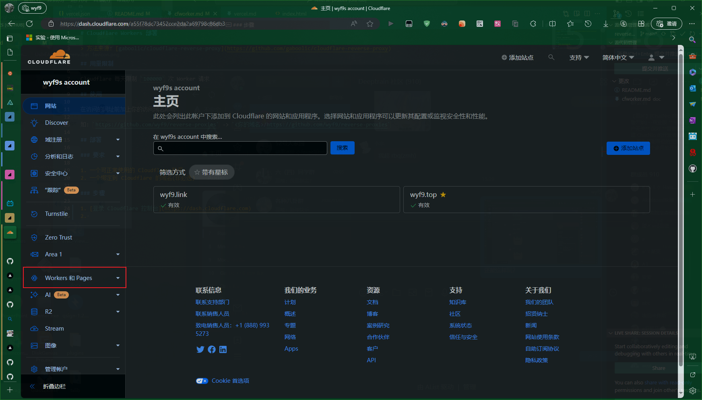
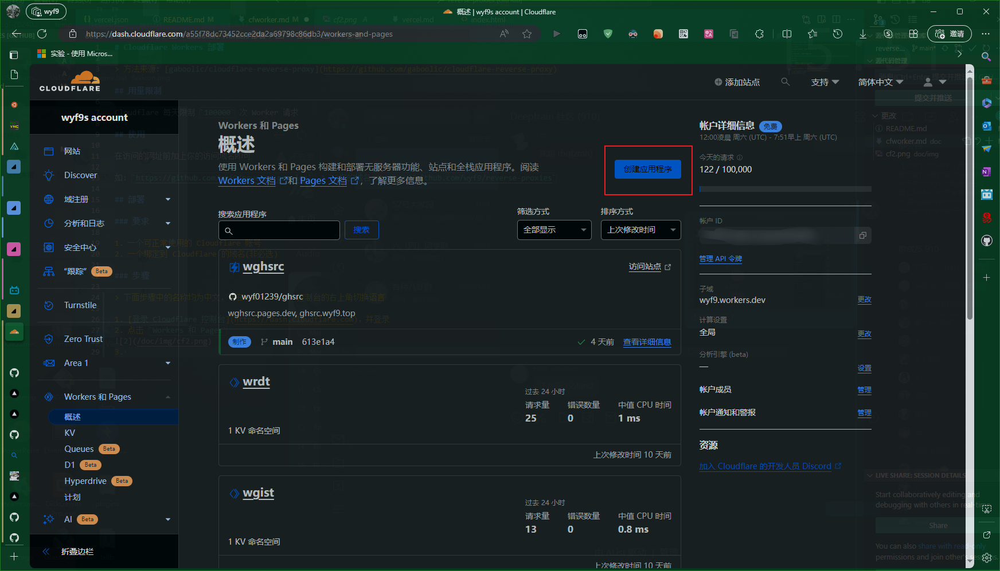
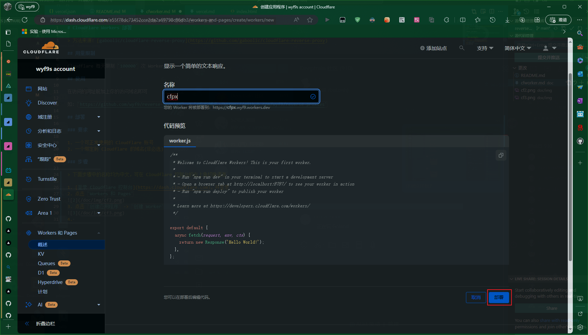
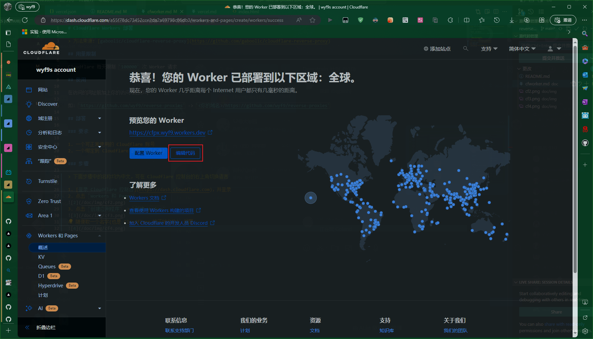
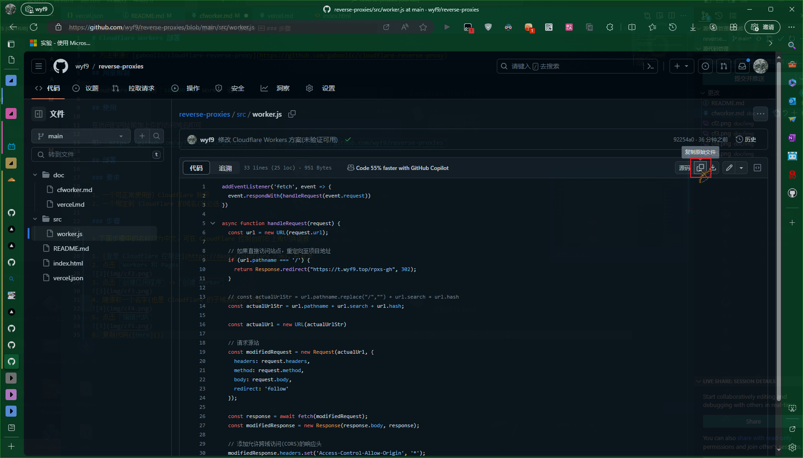
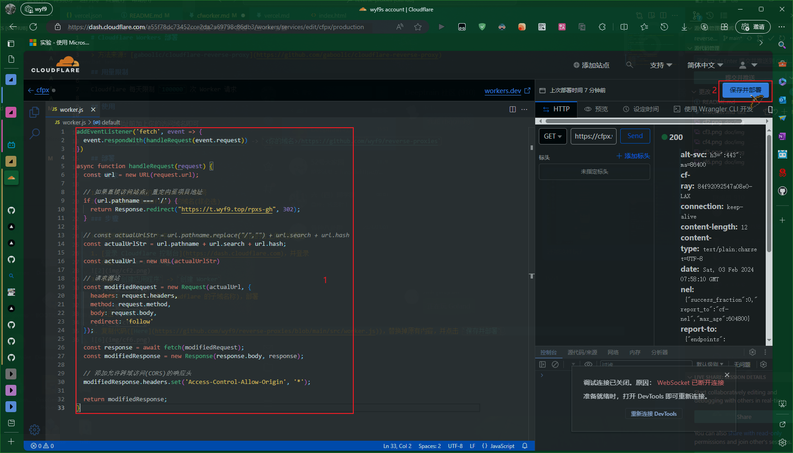

# Cloudflare Workers 部署

> 方法来源: [gaboolic/cloudflare-reverse-proxy](https://github.com/gaboolic/cloudflare-reverse-proxy)

## 用量限制

Cloudflare 每天限制 `100000` 次 Worker 请求

## 使用

在访问的网址前加上你的访问域名即可

如: `https://github.com/wyf9/reverse-proxies` -> `<你的域名>/https://github.com/wyf9/reverse-proxies`

## 部署

### 要求

1. 一个可正常使用的 Cloudflare 账号
2. 一个绑定到 Cloudflare 的域名(非必选)

### 步骤

> 下面步骤中的名称均为中文，可在 Cloudflare 控制台的右上角切换语言为中文

1. [登录 Cloudflare 控制台](https://dash.cloudflare.com)，并登录
2. 点击 `Workers 和 Pages`

3. 点击 `创建应用程序` -> `创建 Worker`

4. 随便取一个名字(也是 Cloudflare 自带的 `workers.dev` 子域名称)，部署

5. 点击 `编辑代码`

6. 复制代码([Here](https://github.com/wyf9/reverse-proxies/blob/main/src/worker.js))，替换掉原有内容，并点击 `保存并部署`

7. [可选]返回，添加自定义域名

> 默认子域可在 Worker 详情页查看: `<Worker 名称>.<自定义子域>.workers.dev`